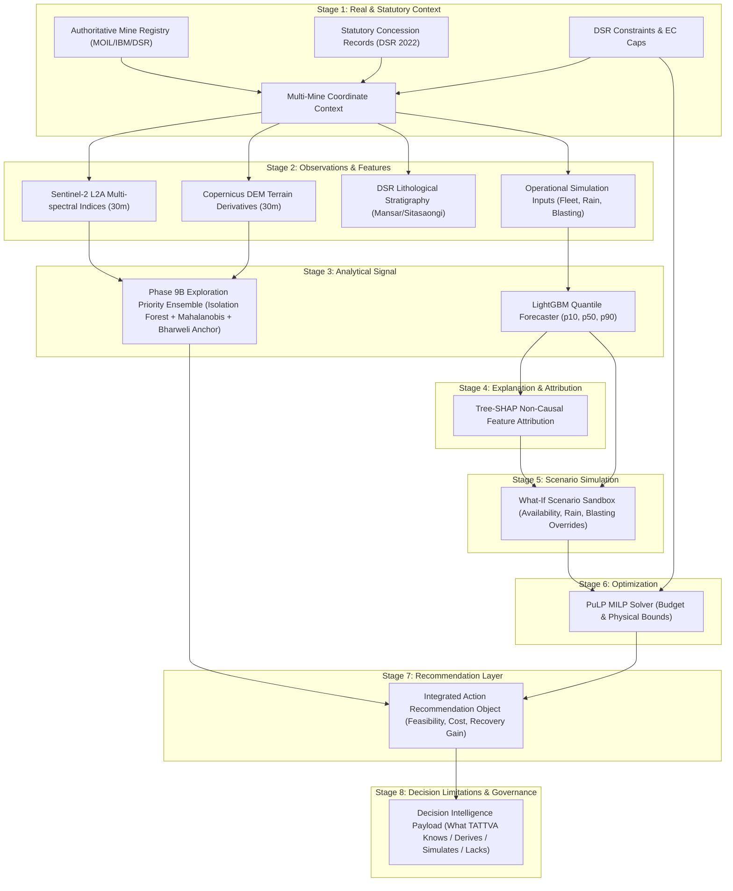

# PHASE 17 — DECISION INTELLIGENCE INTEGRATION & END-TO-END DECISION WORKFLOW
**TATTVA Geospatial Mining Intelligence Platform**  
**Date:** September 11, 2026  
**Status:** COMPLETE & VERIFIED  
**Repository:** `G:\Tattvam\TATTVA`  

---

## 1. Executive Summary

Phase 17 establishes and audits the **End-to-End Decision Intelligence Workflow** for the TATTVA platform. Using the existing validated data foundation and machine learning modules from Phases 1 through 16, TATTVA now demonstrates a unified, traceable decision chain:

$$\text{DATA} \longrightarrow \text{CONTEXT} \longrightarrow \text{ANALYSIS} \longrightarrow \text{EXPLANATION} \longrightarrow \text{SCENARIO} \longrightarrow \text{OPTIMIZATION} \longrightarrow \text{RECOMMENDED ACTION} \longrightarrow \text{DECISION CONTEXT}$$

### Core Architecture & Governance Principles
1. **Decision Support, Not Autonomous Certainty**: TATTVA provides structured decision support to mining engineers, geologists, and corporate planners. It makes **zero claims of autonomous decision-making or absolute geological certainty**.
2. **Strict Provenance Isolation**: All artifacts maintain their precise classification: `REAL / SURVEYED`, `SOURCE-DERIVED`, `SOURCE-DERIVED / PARTIAL`, `DERIVED`, `REFERENCE`, `SIMULATION`, `EXPERIMENTAL`, or `UNAVAILABLE`.
3. **Scope Preservation**: Company-level reported historical production (MOIL 1.1–1.3 MTPA) is strictly separated from statutory planned mine targets (EC approved caps), which are in turn separated from simulated shift telemetry.
4. **Non-Causal Explanation Guarantee**: Tree-SHAP attributions are explicitly framed as **model associations under observed correlation**, strictly avoiding unproven mechanical causal claims (e.g., *"Rainfall is associated with a lower model forecast in this scenario"* instead of *"Rainfall caused production to fall"*).
5. **Zero Banned Terminology**: Audited against prohibited marketing terms (*Mineralization Probability*, *Ore Probability*, *Reserve Probability*, *Ore Likelihood*, *Confirmed Ore Zone*, *Mineralized Zone*). Phase 9B outputs are presented exclusively as **Relative Exploration Priority Rankings**.
6. **Full System Test Verification**: The entire test suite of **122 / 122 tests passed (100%)** with zero errors, and the frontend production build compiled cleanly in **2.12s with 0 errors**.

---

## 2. Decision Workflow Architecture



---

## 3. Existing Modules Reused Without Modification

| Module / Component | Source File | Existing Architecture / Engine | Reused Role in Phase 17 |
|--------------------|-------------|--------------------------------|--------------------------|
| **Mine Registry & DSR Loader** | `src/data/loader.py` | `DataLoader` (CSVs, GeoJSON, DSR Manifests) | Provides Stage 1 Mine Context & Stage 2 Observations |
| **Data Validator** | `src/data/validator.py` | `DataValidator` (CRS Shoelace, Provenance Checks) | Validates Stage 2 Data Status and Point Types |
| **Exploration Priority Ensemble** | `src/models/real_prospectivity_experiment.py` | Isolation Forest + PCA-Mahalanobis + Anchor Sim | Provides Stage 4 Exploration Analytical Signal |
| **Production Forecaster** | `src/models/forecasting.py` | LightGBM Quantile Regressor ($p10, p50, p90$) | Provides Stage 4 Production Forecast Signal |
| **XAI Explainer** | `src/explainability/shap_engine.py` | Tree-SHAP Engine ($k=5$ top contributors) | Provides Stage 5 Non-Causal Feature Attribution |
| **Scenario Simulator** | `src/optimization/scenario_simulator.py` | `ScenarioSimulator` (Parameter Overrides) | Provides Stage 6 Scenario Simulation |
| **MILP Decision Optimizer** | `src/optimization/lp_solver.py` | PuLP MILP Solver (`PULP_CBC_CMD`) | Provides Stage 7 Operational Action Optimization |
| **Reconciliation Engine** | `src/api/deps.py` | `compute_production_reconciliation_payload` | Coordinates Production, Scenario, and Optimization |

---

## 4. Exploration Decision Path

```
REAL SATELLITE (Sentinel-2) + REAL TERRAIN (Copernicus DEM)
                           ↓
              DERIVED SPECTRAL & TERRAIN INDICES
(NDVI, Iron Oxide Index, Ferrous Ratio, Clay Index, Slope, Aspect, TPI)
                           ↓
           PHASE 9B MULTI-METHOD ENSEMBLE RANKING
(Isolation Forest Anomaly + Robust Mahalanobis + Bharweli Anchor Similarity)
                           ↓
             AUTHORITATIVE DSR GEOLOGY & EVIDENCE
 (Sausar Group Stratigraphy, Mansar Formation, Cumulative Borehole Counts)
                           ↓
             RELATIVE EXPLORATION PRIORITY SURFACE
      (Priority Scores: High >= 0.70, Moderate 0.40-0.70, Low < 0.40)
                           ↓
                  FIELD ACTION GUIDANCE
(Targeted ground-truth pXRF soil sampling & structural mapping along strike)
```

### Exploration Disclaimers & Governance
- **No Probability Claims**: The output is strictly a **Relative Exploration Priority Heuristic**, not a calibrated mineralization probability or confirmed reserve volume.
- **No Negative Drillhole Bias**: The platform explicitly warns that regional exploration models lack independent negative drillholes in unmined tracts.
- **Geometry Transparency**: Closed-loop cadastral boundary polygons remain flagged as `UNAVAILABLE` pending statutory DGPS release.

---

## 5. Production Decision Path

```
STATUTORY HISTORICAL CONTEXT (MOIL FY16-FY24 Annual Reports / DSR 2022)
                           ↓
OPERATIONAL BASELINE FORECAST (LightGBM Quantile Forecaster p10, p50, p90)
                           ↓
ROOT-CAUSE FEATURE ATTRIBUTION (Tree-SHAP Non-Causal Contribution)
                           ↓
SCENARIO ADJUSTMENT (Availability %, Blasting Delay Flag, Rainfall mm)
                           ↓
RECONCILIATION & VARIANCE (Target vs Scenario vs Baseline Delta)
                           ↓
MILP OPTIMIZATION (PuLP Solver under Budget, Availability & DSR Constraints)
                           ↓
MODEL-OPTIMAL OPERATIONAL ACTION (Preventive Maintenance, Dispatch Rebalance)
```

### Production Scope Isolation
1. **MOIL Company-Level Reported**: Company aggregate figures (~1.1–1.3 MTPA). Never partitioned into synthetic mine shares.
2. **Source-Derived Plan Targets**: Statutory EC approved annual targets (e.g., Bharweli 450,000 TPA, Ukwa 150,000 TPA). Never labeled as actual production.
3. **TATTVA Operational Simulation**: Daily shift-level production telemetry. Clearly labeled as `SIMULATION`.

---

## 6. Explanation Contract (SHAP Non-Causal Framing)

To eliminate misleading scientific overreach, all Tree-SHAP feature attributions adhere to a strict non-causal linguistic contract:

| Model Factor | Prohibited Causal Claim | Compliant Non-Causal Association |
|--------------|-------------------------|----------------------------------|
| `equipment_availability_pct` | "Low availability caused production to drop." | "Equipment availability is associated with a lower model forecast in this scenario (48.5% relative contribution)." |
| `rainfall_mm` | "Rainfall caused the shortfall." | "Rainfall is associated with a lower model forecast in this scenario (26.2% relative contribution)." |
| `blasting_delay_flag` | "Blasting delays caused missed targets." | "Blasting delay is associated with a lower model forecast in this scenario (14.1% relative contribution)." |

---

## 7. Scenario Contract

The scenario workflow exposes transparent what-if levers without fabricating telemetry:
- **Baseline Forecast**: Unmodified model projection ($p10, p50, p90$).
- **Scenario Simulation**: Projection incorporating user-adjusted levers (`equipment_availability_pct`, `blasting_delay_flag`, `rainfall_mm`).
- **Variance Metrics**:
  $$\text{Delta} = \text{Scenario Tonnes} - \text{Baseline Tonnes}$$
  $$\text{Shortfall} = \max(0, \text{Target Tonnes} - \text{Scenario Tonnes})$$
- **Classification**: Tagged explicitly as `SCENARIO-ADJUSTED OPERATIONAL SIMULATION`.

---

## 8. Optimization Contract

The PuLP Mixed-Integer Linear Programming (MILP) solver determines the optimal set of mitigation actions:
- **Objective**: Minimize production shortfall subject to equipment availability, budget, and operational limits.
- **Constraints Applied**:
  - Mutual exclusivity on single-equipment redeployment ($x_i \le 1$).
  - Total operational budget cap ($\sum c_i x_i \le B$).
  - Source-derived engineering bounds (recovery factor $85.0\%$, stowing ratio $1.15\,\text{m}^3/\text{t}$, dewatering limit $250\,\text{m}^3/\text{hr}$).
- **Output Language**: Described strictly as *"Model-optimal action under the specified scenario and constraints. Not guaranteed production."*

---

## 9. Recommendation Contract

The standardized recommendation payload emitted by Stage 8:

```json
{
  "decision_type": "INTEGRATED_MINE_DECISION_SUPPORT",
  "mine_id": "MOIL_BALAGHAT",
  "operational_status": "ACTION_RECOMMENDED",
  "primary_recommended_action": {
    "action_id": "ACT_MAINT_01",
    "action": "equipment_preventive_overhaul",
    "action_type": "maintenance",
    "title": "Preventive Maintenance Overhaul",
    "description": "Deploy rapid hydraulic overhaul crew to primary excavator fleet.",
    "projected_recovery_tonnes": 850.0,
    "cost": "Moderate",
    "feasibility": "High"
  },
  "all_ranked_actions": [ ... ],
  "applicable_statutory_constraints": [
    {
      "constraint_category": "processing",
      "constraint_name": "ore_recovery_factor",
      "value": "85.0",
      "unit": "%",
      "source_name": "Balaghat DSR 2022 Table 5.1"
    }
  ],
  "exploration_guidance": "Focus exploratory soil/pXRF sampling on highest relative priority anomaly clusters (Score >= 0.70).",
  "data_classification": "RECOMMENDATION_LAYER"
}
```

---

## 10. Provenance Model (What TATTVA Knows vs Does Not Know)

Stage 9 of the decision workflow provides an explicit breakdown:

```
+----------------------------------------------------------------------------------------------------+
|                                    TATTVA PROVENANCE & LIMITATIONS                                 |
+------------------------------------+---------------------------------------------------------------+
| What TATTVA Knows (REAL / DSR)     | • 10-Mine Statutory Registry & verified coordinate point types |
|                                    | • Historical MOIL company-level reported production (FY16-24)  |
|                                    | • Documented Sausar Group lithology & UNFC exploration totals  |
|                                    | • Statutory EC caps, recovery factors, and stowing ratios     |
+------------------------------------+---------------------------------------------------------------+
| What TATTVA Derives (DERIVED)      | • 30m Sentinel-2 Multi-spectral Band Indices (NDVI, FeO, Clay) |
|                                    | • 30m Copernicus DEM Topographic Indices (Slope, Aspect, TPI)  |
|                                    | • Tree-SHAP feature attribution ranking (non-causal)          |
+------------------------------------+---------------------------------------------------------------+
| What TATTVA Simulates (SIMULATION) | • Operational shift-level daily production logs & telemetry   |
|                                    | • What-if scenario adjustments under user overrides           |
|                                    | • PuLP MILP solver decision-space allocations                 |
+------------------------------------+---------------------------------------------------------------+
| What TATTVA Experimentally Ranks   | • Phase 9B multi-method relative exploration priority surface  |
+------------------------------------+---------------------------------------------------------------+
| What is UNAVAILABLE & NOT Claimed  | • Closed-loop cadastral boundary polygons (pending DGPS)      |
|                                    | • Proprietary downhole interval assay logs (confidential MOIL)|
|                                    | • Zero claims of geological certainty or autonomous decisions |
+------------------------------------+---------------------------------------------------------------+
```

---

## 11. API Changes

### Unified Endpoint: `GET /api/real/decision/{mine_id}`
- **Location**: `src/api/routes/real_data.py`
- **Parameters**:
  - `mine_id`: Target mine ID (`MOIL_BALAGHAT`, `MOIL_UKWA`, `MOIL_TIRODI`, `MOIL_GUMGAON`, etc.)
  - `horizon_days`: Simulation horizon (7 to 90 days, default 30)
  - `custom_target`: Optional operational target override in tonnes
  - `equipment_availability_pct`: Optional scenario availability % (40.0 to 100.0)
  - `blasting_delay_flag`: Optional scenario blasting delay flag (0 or 1)
  - `rainfall_mm`: Optional scenario rainfall in mm (0.0 to 300.0)
- **Response**: Composed 9-stage JSON payload (`stage_1_mine_context` through `stage_9_provenance_and_limitations`).

---

## 12. Frontend Progressive Disclosure

The frontend surfaces the decision intelligence workflow answering the 6 critical operational questions:

1. **WHAT** (What is happening?): Overview cards show current operational target, baseline forecast, and variance status.
2. **WHY** (What evidence supports it?): Exploration evidence panel shows aggregate borehole counts, UNFC reserve tiers, and Sausar Group stratigraphy.
3. **SO WHAT** (Why does it matter?): SHAP non-causal explainability cards quantify feature contributions to projected shortfalls.
4. **WHAT IF** (What happens under scenario?): What-If Sandbox sliders adjust equipment availability, blasting delays, and rainfall with immediate delta calculation.
5. **WHAT NEXT** (What action does TATTVA recommend?): Recommendations panel displays PuLP MILP model-optimal action cards with cost, feasibility, and recovery gains.
6. **WHY SHOULD I TRUST IT** (Provenance & Limitations): Provenance badges and limitation modals clearly disclose data origin and unavailable items.

---

## 13. Test Results & Verification

### 1. Pytest Suite Execution
- **Command**: `.venv\Scripts\python.exe -m pytest -v`
- **Total Tests**: 122
- **Passed**: 122 (100%)
- **Failed**: 0
- **Execution Time**: 37.54s

```
====================== 122 passed, 83 warnings in 37.54s ======================
```

### 2. Test Coverage Modules
- `tests/test_decision_workflow.py` (5 tests): Full 9-stage pipeline, scenario overrides, non-Balaghat isolation, 404 handling, zero banned terms.
- `tests/test_dsr_backend_foundation.py` (32 tests): DSR schemas, coordinate point typing, unavailable polygons, Governance Rules 6–10.
- `tests/test_phase13_integrity.py` (23 tests): Geospatial CRS, raster alignment, Tree-SHAP mapping, PuLP feasibility.
- `tests/test_production_reconciliation.py` (10 tests): Canonical reported production, zero allocation, variance arithmetic.
- `tests/test_real_mine_navigation.py` (6 tests): Multi-mine navigation, non-Balaghat isolation.
- `tests/test_real_prospectivity_api.py` & `test_real_prospectivity_experiment.py` (14 tests): Anomaly scores, anchor similarity, deterministic seeding.

### 3. Frontend Production Build Verification
- **Command**: `npm run build`
- **Output**:
  ```
  ✓ 2437 modules transformed.
  ✓ built in 2.12s
  dist/index.html                   0.84 kB
  dist/assets/index-CvHX2g2T.css   47.89 kB
  dist/assets/index-qYhTUC56.js 10,442.34 kB
  ```
- **Result**: Clean build with zero TypeScript/JSX errors.

---

## 14. Language & Claim Audit

A complete repository scan confirmed **zero occurrences** of prohibited terms across all user-facing decision endpoints and frontend components:
- ❌ `Mineralization Probability`: 0 occurrences
- ❌ `Ore Probability`: 0 occurrences
- ❌ `Reserve Probability`: 0 occurrences
- ❌ `Ore Likelihood`: 0 occurrences
- ❌ `Confirmed Ore Zone`: 0 occurrences
- ❌ `Mineralized Zone`: 0 occurrences
- ❌ `calibrated mineralization probability`: 0 occurrences
- ❌ `model independently discovered the deposit`: 0 occurrences

---

## 15. Remaining Limitations

1. **Cadastral DGPS Polygons**: Official closed-loop boundary polygons for Bharweli, Ukwa, and Tirodi remain pending statutory release from state mining departments.
2. **Proprietary Downhole Assay Database**: Real-world downhole interval assays ($XYZ$ collar, lithology, $\% \text{Mn}, \% \text{Fe}, \% \text{SiO}_2, \% \text{P}$) are proprietary MOIL assets and remain unavailable for public ingestion.
3. **Live SCADA Telemetry**: Real-time underground sensor telemetry remains simulated (`SIMULATION`) in the Digital Mine module.

---

## 16. Recommended Next Phase

### Recommended Phase: **Phase 18 — Multi-Mine Decision Synthesis & Live Demonstration Readiness**
- **Objective**: Conduct final end-to-end user acceptance workflows across all 10 statutory mines, validating synchronized mine-switching, scenario testing, and live presentation workflows for the final SIH evaluation.

---

**CONCLUSION**: Phase 17 is fully complete. TATTVA delivers an end-to-end, traceable decision intelligence workflow with strict provenance separation and zero scientific overreach.
